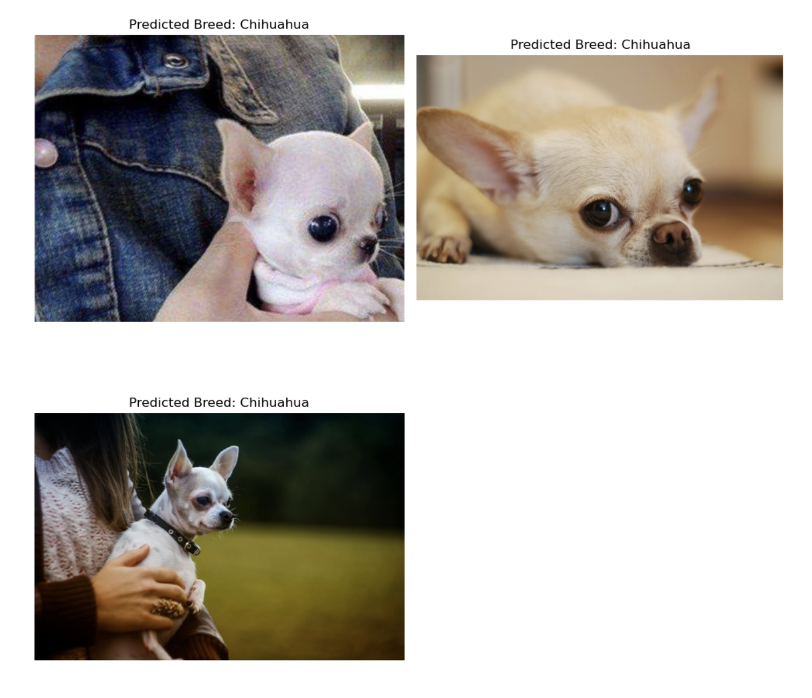

# Dog Identification App

This project is a Dog Breed Identification application built with TensorFlow/Keras. The model leverages a pre-trained VGG16 model for feature extraction, followed by a custom classifier to predict the breed of dogs from images.

## Project File


The project is contained in a single Jupyter notebook:

- **DogIdentificationApp.ipynb**: Contains the full implementation of the app, including the model loading, image preprocessing, prediction, and visualization of results.

### Dog Image Dataset
The primary dataset used in this project consists of images of dogs across 133 different breeds. The dataset is provided by Udacity and can be downloaded using the following link:

- [Dog Image Dataset (Udacity)](https://s3-us-west-1.amazonaws.com/udacity-aind/dog-project/dogImages.zip)

After downloading, the dataset should be extracted into the following structure:

```

dogImages/
    ├── train/
    ├── valid/
    └── test/
```


#### Dog Breeds Overview
Below is an overview of some dog breeds used in the classification:


## Prerequisites

Ensure you have the following packages installed:

- `tensorflow`
- `keras`
- `numpy`
- `matplotlib`
- `Pillow`

Install the required packages using pip:

```bash
pip install tensorflow keras numpy matplotlib Pillow
```


### Preprocessed VGG16 Features
In addition to the image dataset, we utilize preprocessed bottleneck features from the VGG16 model. These bottleneck features allow the model to leverage the pre-trained weights from VGG16, improving the training efficiency and accuracy.

- [Preprocessed VGG16 Bottleneck Features](https://drive.google.com/file/d/18haFZAdGo4TTlPI_cwpN8t5RcqJh8ECG/view?usp=sharing)

After downloading the `DogVGG16Data.npz` file, ensure it is placed in the working directory where the code will access the preprocessed data for training and validation.


## How to Use
1. **Clone this repository.**
2. **Download the datasets:**
   - Download and extract the [Dog Image Dataset](https://s3-us-west-1.amazonaws.com/udacity-aind/dog-project/dogImages.zip).
   - Download the [Preprocessed VGG16 Bottleneck Features](https://drive.google.com/file/d/18haFZAdGo4TTlPI_cwpN8t5RcqJh8ECG/view?usp=sharing) and place the `DogVGG16Data.npz` file in your working directory.
3. **Run the provided Jupyter Notebook** (`DogIdentificationApp.ipynb`) to train the model or use the pre-trained model for predictions.
4. **Upload an image of a dog**, and the model will predict the breed.

#### Predicted Breeds: Chihuahua


#### Predicted Breeds: Great Pyrenees and Bernese Mountain Dog


## License

This project is licensed under the MIT License.

### Key Points:
- The `Dog Image Dataset` link provides the user with the dog images dataset from Udacity. Instructions on extracting and organizing the dataset are provided.
- The `Preprocessed VGG16 Bottleneck Features` link directs the user to download the `.npz` file from Google Drive and place it in their working directory for use.
- Example prediction results and training/validation plots are included with appropriate images for visual representation.


